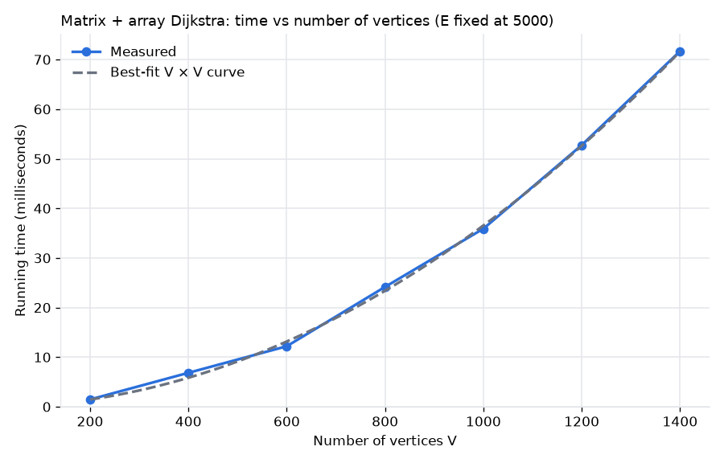
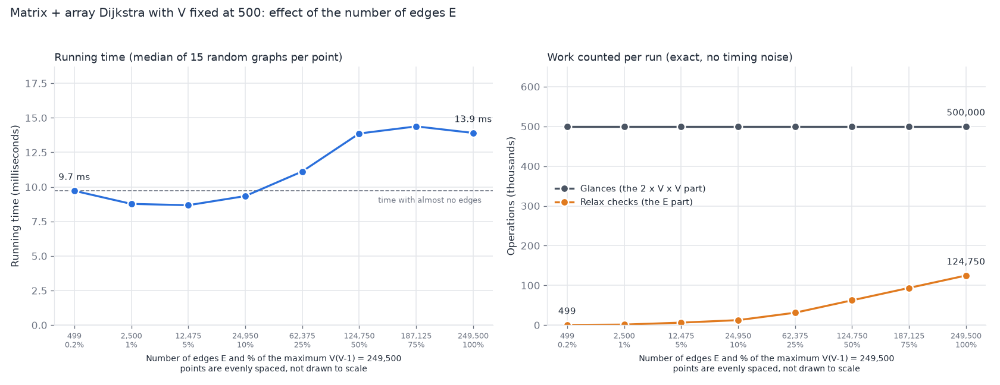
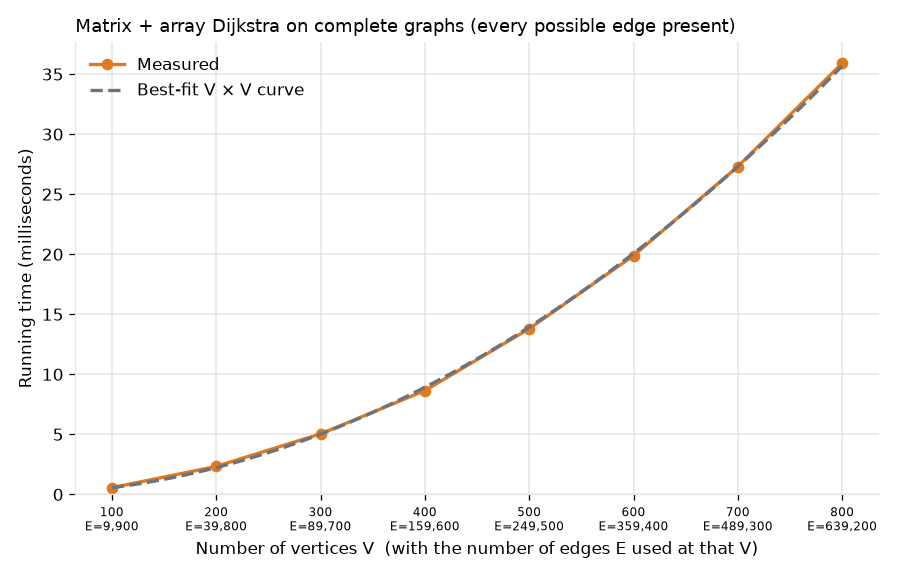
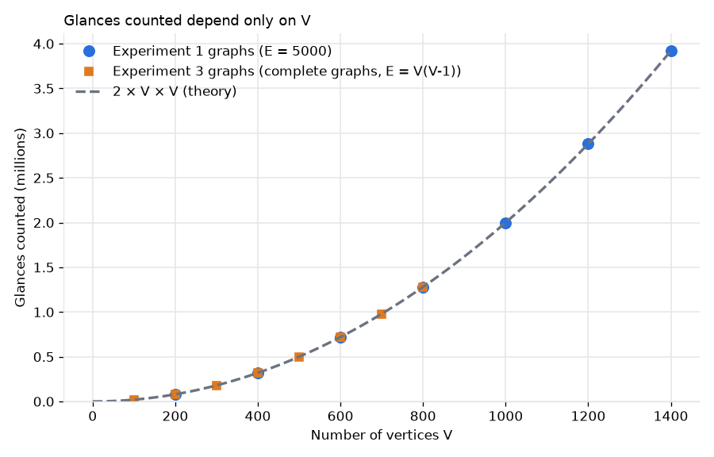

# Dijkstra's Algorithm, Part (a): Adjacency Matrix + Array

SC2001 Algorithm Design and Analysis, Project 2.

**Part (a) of the brief, verbatim:**

> (a) Suppose the input graph G = (V, E) is stored in an adjacency matrix and we use an array for the priority queue. Implement the Dijkstra's algorithm using this setting and analyze its time complexity with respect to |V| and |E| both theoretically and empirically.

This README explains the whole of part (a) from start to end: what the code does, the theory, how it was tested, the three experiments, and the overall conclusion.

## 1. Short version

1. The graph is stored as a V by V matrix, and the priority queue is a plain list that is scanned for its smallest entry.
2. Theory: the program makes exactly 2 x V x V glances (single reads), plus at most E extra relax checks, so the time is O(V^2 + E), which simplifies to **O(V^2)**.
3. Experiments 1 and 3 show the time grows as V^2: doubling V makes the work about 4 times larger.
4. Experiment 2 shows E does not change that growth: the glance count is identical for every E, and the running time rises only about 1.4 times between an almost empty and a completely full matrix.
5. So **for this implementation the running time depends on V, and E only changes the size of the multiplier, not how the time grows.**

## 2. What is in this folder

| File | What it is |
|---|---|
| `part-a/dijkstra_matrix.py` | The implementation, with comments. Contains `build_matrix`, `dijkstra_matrix` (the version that is timed), `dijkstra_matrix_counted` (same algorithm, also counts glances) and `get_path`. |
| `part-a/actual_dijkstra.py` | The same algorithm with no comments, for reading. |
| `part-a/graph_gen.py` | Makes random directed weighted graphs with NetworkX. |
| `part-a/test_correctness.py` | Checks the code gives correct answers (15 tests). |
| `part-a/experiments_2.py` | Runs experiments 1 and 3 (it also reruns the older version of experiment 2, which is now replaced). |
| `part-a/experiments_vary_E.py` | Runs the final version of experiment 2. |
| `_Results/results_vary_V.csv`, `exp1_vary_V.png` | Experiment 1 results. |
| `_Results/results_vary_E_theory.csv`, `exp2_vary_E_theory.png` | Experiment 2 results (final version). |
| `_Results/results_complete.csv`, `exp3_complete.png` | Experiment 3 results. |
| `_Results/glance_count.png` | Glance counts from experiments 1 and 3 on one chart. |
| `_Results/results_vary_E.csv`, `exp2_vary_E.png` | The older experiment 2. Kept for the record, not used in the conclusions. |

The scripts save their outputs next to themselves. The results listed under `_Results` are those files moved into that folder.

## 3. Setup and how to run

You need Python 3. Install the two packages the code uses:

```
python -m pip install matplotlib networkx
```

On Windows, use `py` in place of `python` if `python` is not recognised. Then, from the `part-a` folder:

```
python test_correctness.py            # should end with: ALL TESTS PASSED
python experiments_2.py --quick       # experiments 1 and 3, small sizes, finishes in seconds
python experiments_2.py               # experiments 1 and 3, full run, takes a few minutes
python experiments_vary_E.py --quick  # experiment 2, small and fast
python experiments_vary_E.py          # experiment 2, full run, under a minute
```

Add `--show` to also pop up the charts. For clean timings, do not run other heavy programs during a full run.

## 4. Vocabulary

| Term | Meaning |
|---|---|
| **V** | Number of vertices (nodes), numbered 0 to V - 1. |
| **E** | Number of edges (arrows), each going from one vertex to another. |
| **Weight** | The cost of one edge. It lives in the matrix and never changes. Here weights are whole numbers from 1 to 100. |
| **Distance** | The total weight along the best route found so far from the start vertex. It lives in `dist`. |
| **Directed graph** | An edge from 2 to 5 does not also give an edge from 5 to 2. No self loops and no duplicate edges. |
| **Adjacency matrix** | A V by V grid where `matrix[from][to]` is the weight of that edge, or `INF` (infinity) if there is none. |
| **`dist`, `parent`, `visited`** | Three lists with one entry per vertex: best distance so far, the previous vertex on that route (-1 for none), and True once the distance is final. |
| **Array priority queue** | The `dist` list plus a scan for the smallest unfinished entry. "Priority" means smallest distance goes next, not first in goes next. |
| **Round** | One pass of the main loop. Each round finishes exactly one vertex, so there are V rounds. |
| **Glance** | Reading one entry of `dist` or one cell of the matrix. |
| **Relax check** | Testing whether going through the vertex just picked gives a shorter route to a neighbour: add the weight and compare. |
| **Update** | A relax check that found a strictly shorter route and lowered `dist`. |
| **Operation** | Any one counted step. Glances and relax checks are the two kinds. |
| **Complete graph** | Every possible edge exists, so E = V x (V - 1). |
| **Big-O** | How the cost grows as the input gets larger, ignoring constant multipliers and smaller terms. |

## 5. How the program flows

1. Pick two numbers, V and E.
2. `random_directed_graph(V, E)` returns the edge list: exactly E tuples `(from, to, weight)`.
3. `build_matrix(V, edges)` returns the V by V matrix, fully filled. It is built once and only read after that.
4. `dijkstra_matrix(matrix, 0)` reads the matrix and returns `dist` and `parent`. This is the only step that is timed.
5. The experiment script records the time, plus the glance, relax-check and update counts, repeats for several random graphs, and averages them.
6. The results are saved to CSV files and drawn as charts with matplotlib.

Nothing is typed in or read from a file. The graph is made by code and passed from one function to the next. There is no `input()` call anywhere.

**Example, V = 4 and E = 5** (hand-picked, so it is easy to follow):

```
edges = [(0,1,2), (0,2,5), (1,2,1), (1,3,4), (2,3,4)]
```

`(0,1,2)` means an arrow from vertex 0 to vertex 1 that costs 2. The matrix built from it is:

```
        to: 0    1    2    3
from 0:  [ 0,   2,   5,  inf]
from 1:  [inf,  0,   1,   4 ]
from 2:  [inf, inf,  0,   4 ]
from 3:  [inf, inf, inf,  0 ]
```

The diagonal is 0 because a vertex to itself costs nothing. Running Dijkstra from vertex 0 gives `dist = [0, 2, 3, 6]` and `parent = [-1, 0, 1, 1]`.

## 6. How the algorithm works

Each round does two scans of length V. In this README they are called **Scan A** and **Scan B**.

- **Scan A (the array priority queue).** Read down the `dist` list, skip visited vertices, and remember the smallest distance. That vertex is picked and marked visited. Marking it visited means its distance is now final. This is V glances.
- **Scan B (relax).** Read across the picked vertex's matrix row, one cell per vertex. For each real edge to an unvisited vertex, do a relax check: `candidate = dist[u] + w`, and if `candidate < dist[v]` then set `dist[v] = candidate` and `parent[v] = u`. This is V glances.

**The matrix is never updated.** Only `dist`, `parent` and `visited` change while the algorithm runs. The matrix cells hold edge weights, not distances from the start.

**The visited list.** The video this was learned from keeps a visited list and an unvisited list. The code keeps one list, `visited`, with True or False per vertex. False means the distance in `dist` is still only a best guess. True means it is final. Both scans skip visited vertices.

**One update.** In round 2 of the example, vertex 1 is picked (distance 2). Its row is `[inf, 0, 1, 4]`. The edge to vertex 2 has weight 1, so the candidate is 2 + 1 = 3, which is less than the current 5. So `dist[2]` becomes 3 and `parent[2]` becomes 1. In round 3, the edge from vertex 2 to vertex 3 gives 3 + 4 = 7, which is not less than the current 6, so nothing changes.

**All four rounds of the example:**

| Round | Vertex picked | Row scanned | Relax checks | Updates | `dist` afterwards | Glances (A + B) |
|---|---|---|---|---|---|---|
| 1 | 0 (distance 0) | `[0, 2, 5, inf]` | 0 to 1, 0 to 2 | both | `[0, 2, 5, inf]` | 4 + 4 |
| 2 | 1 (distance 2) | `[inf, 0, 1, 4]` | 1 to 2, 1 to 3 | both | `[0, 2, 3, 6]` | 4 + 4 |
| 3 | 2 (distance 3) | `[inf, inf, 0, 4]` | 2 to 3 | none | `[0, 2, 3, 6]` | 4 + 4 |
| 4 | 3 (distance 6) | `[inf, inf, inf, 0]` | none | none | `[0, 2, 3, 6]` | 4 + 4 |

That is 4 rounds x 8 glances = 32 glances, 5 relax checks and 4 updates.

## 7. Theory

Dijkstra does two kinds of work: V extract-min steps (pick the smallest unfinished distance) and at most E edge relaxations. The general formula is V x (cost of one extract-min) + E x (cost of one distance update). The answer depends on how the graph is stored and how the priority queue is built. For part (a) the textbook answer is **O(V^2)**. It is derived like this:

1. Setup creates three lists of V entries: about V steps.
2. There are V rounds, since each round finishes exactly one vertex.
3. Scan A reads all V entries of `dist` every round: V glances per round.
4. Scan B reads all V cells of one matrix row every round, even when most cells are `inf`: V glances per round.
5. Total glances: V rounds x (V + V) = **2 x V x V**. The first V^2 comes from Scan A (the same `dist` list read V times). The second V^2 comes from Scan B (every matrix row read once, so the whole matrix is read once).
6. Each real edge is relaxed at most once, because its starting vertex is picked only once and its row is read only once. So there are at most E relax checks, each a few cheap steps.
7. Total: c1 x V + 2 x V^2 + c2 x E, which is O(V^2 + E).
8. In a directed graph with no self loops and no duplicates, E is at most V x (V - 1), which is less than V^2. So the E term can never grow faster than the V^2 term, and the answer simplifies to **O(V^2)**.

What this predicts, with respect to |V| and |E|:

1. **With respect to |V|:** quadratic. Doubling V makes the work about 4 times larger.
2. **With respect to |E|:** the full bound is O(V^2 + E), but E can only ever add a term no bigger than V^2. So E does not change the growth rate. For a fixed V, the time rises by a small, bounded amount as E grows, and no more.
3. **Tight:** the glance count is exactly 2V^2 for every graph where all vertices are reachable from the start vertex. So V^2 is not just an upper bound. The growth really is quadratic.

## 8. How the tests were done

### Correctness (`test_correctness.py`)

All 15 tests pass ("ALL TESTS PASSED"). They are in four groups:

1. **Hand-made cases,** with answers worked out by hand, including the graph from the video the algorithm was learned from.
2. **Edge cases:** a single vertex, an unreachable vertex, direction mattering, tied routes, a different start vertex, a longer route beating a direct edge, and a negative weight being rejected.
3. **Random graphs compared with two independent references:** a second Dijkstra written with an adjacency list and a heap (500 random graphs), and NetworkX's own Dijkstra (100 random graphs). It also checks that every parent pointer really explains its distance.
4. **The glance counter:** the counting version gives the same answers as the timed version, and the glance count is exactly 2 x V^2.

### Timing experiments

1. Graphs are random, directed, with weights from 1 to 100, no self loops and no duplicate edges. Every vertex is reachable from the start vertex 0. Seeds are fixed, so the graphs are identical on every run.
2. Only the `dijkstra_matrix` call is timed. Graph generation and matrix building are not timed, and garbage collection is switched off while timing.
3. Glance counts come from a separate, untimed run of the counting version on the same graph, so counting never slows the timed version.

| Experiment | What changes | What is fixed | Graphs per point | Reported value |
|---|---|---|---|---|
| 1 | V from 200 to 1400 | E = 5,000 | 5 | average |
| 2 | E from 499 to 249,500 (8 points) | V = 500 | 15 | median |
| 3 | V from 100 to 800 | complete graphs, E = V x (V - 1) | 5 | average |

### Why experiment 2 was redone

The first version of experiment 2 used E = 1,000 to 200,000 on an evenly scaled axis. That was too wide a range to read: the three smallest E values were squeezed into the first tick of the axis, so you could not tell them apart, the largest E was below the maximum possible, and one noisy point dipped at the end. It also did not record relax checks.

The final version picks E values that the theory says matter. The matrix has V x V = 250,000 cells and the most edges possible is E_MAX = V x (V - 1) = 249,500. E only matters compared with V^2, so the E values are:

- **499** = V - 1: the fewest edges that still reach every vertex (the baseline).
- **2,500** = 5 x V: a typical sparse graph.
- **12,475, 24,950, 62,375, 124,750 and 187,125:** 5, 10, 25, 50 and 75 percent of E_MAX (how full the matrix is).
- **249,500:** 100 percent of E_MAX, the complete graph (the ceiling).

It also uses 15 graphs per point and reports the median, so one slow run cannot create a fake dip, and records the relax-check count. Every dot is labelled on the axis with its E and its percent full.

## 9. Experiment 1: vary V, E fixed at 5,000

**Files:** `results_vary_V.csv` and `exp1_vary_V.png`.

`results_vary_V.csv`, verbatim:

```
V,E,seconds,glances,updates
200,5000,0.0014672799996333196,80000.0,541.6
400,5000,0.006840600000214181,320000.0,858.8
600,5000,0.012195939999946859,720000.0,1067.0
800,5000,0.024162639999485692,1280000.0,1270.8
1000,5000,0.035897540000223674,2000000.0,1441.0
1200,5000,0.05275096000041231,2880000.0,1588.6
1400,5000,0.07169398000005459,3920000.0,1759.8
```

The columns are V, E, the average running time in seconds, the average glance count, and the average number of updates.



**The chart (`exp1_vary_V.png`).** The x-axis is V from 200 to 1400 and the y-axis is running time in milliseconds. The blue line with dots is the measured time, rising from 1.47 ms to 71.69 ms. The grey dashed line is the best-fitting curve of the form (constant x V x V). The line curves upward instead of rising in a straight line, and the dots sit almost exactly on the dashed curve. They sit slightly above it at V = 400 (6.84 ms measured against about 5.85 ms on the curve) and slightly below it at V = 600 (12.20 ms against about 13.15 ms). The best-fit constant is chosen from the data, so the chart tests the shape of the growth, not the size of the multiplier.

**Why it looks like this.** Time is dominated by the 2V^2 glances, and V^2 makes a curve that bends upward.

**Relating it to the theory, "With respect to |V|: quadratic. Doubling V makes the work about 4 times larger":**

| Doubling | Glances (CSV) | Time (CSV) |
|---|---|---|
| V = 200 to 400 | 80,000 to 320,000, exactly 4 times | 1.47 to 6.84 ms, 4.66 times |
| V = 400 to 800 | 320,000 to 1,280,000, exactly 4 times | 6.84 to 24.16 ms, 3.53 times |
| V = 600 to 1200 | 720,000 to 2,880,000, exactly 4 times | 12.20 to 52.75 ms, 4.33 times |

1. **The glances confirm the theory exactly.** Doubling V multiplied the glance count by exactly 4 in every case.
2. **The time confirms it approximately.** The ratios (3.53 to 4.66) wobble around 4 because real timings are noisy, especially at small sizes where a run takes only a millisecond or two.
3. **A second check across the whole range.** V grew 7 times (200 to 1400) and the time grew about 48.9 times. A pure V^2 law would give 7 x 7 = 49.
4. **The growth exponent.** A line fitted to the log of time against the log of V has slope about 1.97. An exponent of 2 means exactly quadratic.
5. **Time divided by V x V is roughly constant.** It stays between 33.9 and 42.8 nanoseconds, with a mean of about 37. If the growth were not quadratic, this number would drift steadily up or down.

**On E:** E is fixed at 5,000 here. At V = 200 the glances are 80,000 and the relax checks are at most 5,000, so the E term is small and shrinks further as V grows. This is why the curve is so close to a pure V^2 shape.

**On "tight":** glances divided by V^2 is exactly 2.000 in every row, which is the exact 2V^2 count.

**Conclusion of experiment 1:** the time grows as V^2, and each doubling of V multiplies the glances by exactly 4 and the time by about 4.

## 10. Experiment 2: vary E, V fixed at 500

**Files:** `results_vary_E_theory.csv` and `exp2_vary_E_theory.png`.

`results_vary_E_theory.csv`, verbatim:

```
V,E,percent_full,seconds_median,seconds_mean,seconds_min,glances,relax_checks,updates
500,499,0.2,0.009720400004880503,0.010524060004778827,0.008575500003644265,500000,499,499
500,2500,1.002004008016032,0.008772400004090741,0.00878613333334215,0.008134300005622208,500000,1249.3333333333333,717.8666666666667
500,12475,5.0,0.008677100006025285,0.008759006666756856,0.008224200006225146,500000,6235.933333333333,1352.2
500,24950,10.0,0.009337700001196936,0.010394006665834846,0.00881179999851156,500000,12475.533333333333,1643.8
500,62375,25.0,0.011118800000986084,0.011098980000436616,0.01056159999279771,500000,31159.733333333334,1955.2
500,124750,50.0,0.013864799999282695,0.013843979997909628,0.013069699998595752,500000,62374.066666666666,2135.4666666666667
500,187125,75.0,0.014380799999344163,0.014569080000122388,0.013553199998568743,500000,93570.13333333333,2216.133333333333
500,249500,100.0,0.01390720000199508,0.01420428666654819,0.013231200005975552,500000,124750,2249.266666666667
```

The new columns are `percent_full` (E as a percent of V x (V - 1)), `seconds_median`, `seconds_mean` and `seconds_min` (over 15 random graphs), and `relax_checks` (the average number of relax checks).

The same data in a readable form:

| E | % full | Median time (ms) | Glances | Relax checks | Updates |
|---|---|---|---|---|---|
| 499 | 0.2 | 9.72 | 500,000 | 499 | 499 |
| 2,500 | 1 | 8.77 | 500,000 | 1,249 | 718 |
| 12,475 | 5 | 8.68 | 500,000 | 6,236 | 1,352 |
| 24,950 | 10 | 9.34 | 500,000 | 12,476 | 1,644 |
| 62,375 | 25 | 11.12 | 500,000 | 31,160 | 1,955 |
| 124,750 | 50 | 13.86 | 500,000 | 62,374 | 2,135 |
| 187,125 | 75 | 14.38 | 500,000 | 93,570 | 2,216 |
| 249,500 | 100 | 13.91 | 500,000 | 124,750 | 2,249 |



**The theory being tested:** "With respect to |E|: the full bound is O(V^2 + E), but E can only ever add a term no bigger than V^2. So E does not change the growth rate."

The chart has two panels, and each dot is labelled with its E and how full the matrix is. The dots are evenly spaced, not to scale.

### Right panel: counted work

**Grey line, 500,000 glances.** "From E = 499 to E = 249,500, the glance count is 500,000 at every point." A glance is reading one entry or one cell, and the program reads every cell of the row whether or not an edge is there, so this count is always 2 x V x V and never depends on E.

**Orange line, relax checks.** "The relax checks grow from 499 to 124,750." A relax check is the extra add and compare done only when a cell is a real edge to an unfinished vertex, so more edges means more checks. Even at the top they are only a quarter of the glance count (124,750 out of 500,000).

**Conclusion of the right panel:** the V^2 part of the work never changes with E, and the E part is smaller and bounded, so E only changes the multiplier and not the growth rate.

1. **The grey line is flat at 500,000.** The program does the same 2V^2 glances whether the matrix has 499 edges or 249,500.
2. **The orange line rises but stays below the grey one.** It cannot grow beyond about this, because E can never exceed V x (V - 1). At 100 percent full the relax checks are exactly half the edges (124,750 of 249,500), because an edge is only checked if its starting vertex is picked before its end vertex.
3. **The total work is mostly the fixed V^2 part with a small extra on top.** This matches the theory.

### Left panel: running time

"From E = 499 (almost empty matrix) to E = 249,500 (full matrix), the time goes from 9.7 ms to 13.9 ms, about 1.4 times." It stays near 9 ms while the matrix is under about 10 percent full, rises as the matrix fills with real edges, then levels off at about 14 ms.

1. **The flat start is the glance floor.** While the matrix is under about 10 percent full, the 500,000 glances dominate and the few relax checks add almost nothing. The small dip at the start is noise: the first point has a few slow runs (its mean is 10.52 ms but its fastest run is 8.58 ms), and the fastest runs at E = 499, 2,500 and 12,475 are 8.58, 8.13 and 8.22 ms, nearly identical.
2. **The rise comes from the relax checks.** As the matrix fills with real edges, more relax checks happen, and each costs an add and a compare, so the time climbs.
3. **The level top shows the rise is capped.** From E = 124,750 to E = 249,500 the time stays near 14 ms (13.9, 14.4, 13.9 ms). The relax checks are still growing, but the extra time is only about 0.5 ms, which is within the run-to-run noise (the fastest runs are 0.7 to 0.8 ms below the median at these points). No deeper cause for the level tail was established.
4. **This version gains nothing from sparse graphs.** A graph with 499 edges costs almost the same time as one with 62,375 edges, because the program reads every matrix cell regardless of how many edges exist.

**Conclusion of the left panel:** running time is a fixed floor from the glances plus a small, bounded rise as the matrix fills up, so E changes the time only by a small multiplier (about 1.4 times from an almost empty to a completely full matrix).

**Conclusion of experiment 2:** more edges only add a small, capped amount of extra work on top of a fixed 500,000 glances, so E does not change how the time grows. Experiment 2 agrees with the theory.

## 11. Experiment 3: complete graphs

**Files:** `results_complete.csv`, `exp3_complete.png` and `glance_count.png`.

`results_complete.csv`, verbatim (complete graphs, so E = V x (V - 1)):

```
V,E,seconds,glances,updates
100,9900,0.0005598199997621123,20000.0,364.8
200,39800,0.0023294000002351822,80000.0,828.2
300,89700,0.005042079999111593,180000.0,1297.6
400,159600,0.00864151999958267,320000.0,1783.0
500,249500,0.013797400000112248,500000.0,2265.6
600,359400,0.019881600000007892,720000.0,2742.4
700,489300,0.027306080000198563,980000.0,3235.0
800,639200,0.0359085199997935,1280000.0,3691.8
```



**The chart (`exp3_complete.png`).** The x-axis is V from 100 to 800, with the E used at each V written under each tick (E = 9,900 up to E = 639,200). The y-axis is running time in milliseconds. The orange measured line and the grey dashed best-fit V x V curve are almost on top of each other all the way from 0.56 ms to 35.91 ms.

**Why it looks like this.** A complete graph means every possible edge exists, so E grows as fast as V^2. This is the extreme case for the E term, and the curve is still a clean V^2 shape.

**Relating it to the theory on V:**

| Doubling | Glances (CSV) | Time (CSV) |
|---|---|---|
| V = 100 to 200 | 20,000 to 80,000, exactly 4 times | 0.56 to 2.33 ms, 4.16 times |
| V = 200 to 400 | 80,000 to 320,000, exactly 4 times | 2.33 to 8.64 ms, 3.71 times |
| V = 400 to 800 | 320,000 to 1,280,000, exactly 4 times | 8.64 to 35.91 ms, 4.16 times |

Time divided by V x V stays between 54.0 and 58.2 nanoseconds, and the fitted exponent is about 1.99. This is even tighter than experiment 1, because the E term here is large and steady instead of tiny.

**Relating it to the theory on E.** In a complete graph, E is about V^2, so the full bound O(V^2 + E) is about 2V^2 and still O(V^2). The curve shape did not change, but the multiplier did. Comparing experiments 1 and 3 at the same V, the complete graphs cost about 1.5 times as much per V x V (a mean of 55.8 nanoseconds against 37.2). This is exactly "E only changes the multiplier, not the growth rate".

**On "tight":** the glances column is 2V^2 exactly again (for example 1,280,000 at V = 800), even though E is 639,200.

### The glance chart: `glance_count.png`



The x-axis is V and the y-axis is glances counted, in millions. The blue circles come from the glances column of `results_vary_V.csv` (E = 5,000), the orange squares come from the glances column of `results_complete.csv` (E = V x (V - 1)), and the grey dashed curve is the theory, 2 x V x V. The title is "Glances counted depend only on V".

Every point, from both experiments, lands on the same dashed curve. For example, V = 800 gives 1,280,000 glances whether E is 5,000 or 639,200. A sparse graph and a complete graph with the same V cost exactly the same number of glances. This is the clearest picture of the "tight" point: the count is not just bounded by 2V^2, it equals 2V^2 exactly, and it shows the E theory directly, since two very different E values produce the same dots.

**Conclusion of experiment 3:** even with the most edges possible, the time still grows as V^2 (about 4 times per doubling of V), and E only raises the multiplier (about 1.5 times).

## 12. The three theory points against the evidence

| Theory point | Where it shows | What it shows |
|---|---|---|
| Quadratic in V, doubling V gives about 4 times the work | `results_vary_V.csv`, `exp1_vary_V.png`, `results_complete.csv`, `exp3_complete.png` | Glances exactly 4 times on every doubling. Time 3.5 to 4.7 times. Fitted exponent about 1.97 and 1.99. |
| E does not change the growth rate | `results_vary_E_theory.csv`, `exp2_vary_E_theory.png` | Glances constant at 500,000 for E from 499 to 249,500. Time rose about 1.4 times from an almost empty to a full matrix, and levelled off. |
| Tight, glances exactly 2V^2 | All three CSVs, `glance_count.png` | Glances divided by V^2 is exactly 2.000 in every row. |

## 13. Overall conclusion for part (a)

Putting the whole of part (a) in one chain:

1. **Implementation.** Dijkstra's algorithm was implemented with the graph stored in a V by V adjacency matrix and an array (the `dist` list, scanned for its smallest unfinished entry) as the priority queue. It passes all 15 correctness tests, including comparisons against an independent Dijkstra and NetworkX.
2. **Theory.** Each of the V rounds does one scan of length V down `dist` and one scan of length V across a matrix row, so the program makes exactly 2V^2 glances, plus at most E relax checks. The time is O(V^2 + E), and because E is at most V x (V - 1), this is **O(V^2)**.
3. **Empirical, with respect to |V|.** Experiments 1 and 3 confirm quadratic growth. Every doubling of V multiplied the glances by exactly 4 and the running time by about 4, and the fitted growth exponents were about 1.97 and 1.99.
4. **Empirical, with respect to |E|.** Experiment 2 confirms that E does not change the growth rate. The glance count was 500,000 at every E, and the running time rose only about 1.4 times between an almost empty and a completely full matrix.
5. **The extreme case.** Experiment 3 shows that even complete graphs, where E is as large as V^2, still grow as V^2. They cost about 1.5 times as much per V x V as sparse graphs, so E only changes the multiplier.
6. **Tightness.** The glance count equals 2V^2 exactly in every row of every experiment, so V^2 describes the growth itself, not just an upper limit.

**Final conclusion: with an adjacency matrix and an array priority queue, Dijkstra's running time grows as V^2, theoretically and empirically. The number of edges E changes only the size of the multiplier (about 1.4 times from empty to full at V = 500, and about 1.5 times for complete graphs against sparse ones), never the growth rate. A practical consequence is that this version gains nothing from sparse graphs: a graph with few edges costs about the same as one with many, because the program reads every matrix cell regardless.**

The comparison with the adjacency list and heap implementation belongs to parts (b) and (c) and is not covered here.

## 14. Limitations

1. **Timings come from one laptop and vary between runs.** The glance, relax-check and update counts do not vary at all. Absolute times depend on the computer and on Python, so only the growth and the ratios should be compared.
2. **Experiments 1 and 3 use 5 graphs per point and the average, while experiment 2 uses 15 graphs and the median.** This is why experiment 2 is less noisy.
3. **The random graph generator is not purely random.** NetworkX's generator does not guarantee that every vertex is reachable from vertex 0, so `graph_gen.py` adds a few edges to repair this and removes the same number of other edges, which keeps E exact. The graphs are very close to, but not exactly, plain random graphs.
4. **The glance count covers only the table and matrix scans.** The extra work on each real edge (the relax checks) is counted separately, and only in experiment 2.
5. **The level tail of experiment 2** (E from 124,750 to 249,500) is explained only as being within noise. No deeper cause was established.
6. **Only some settings were tested.** Experiment 1 fixes E = 5,000 and experiment 2 fixes V = 500. Only directed graphs were used.
